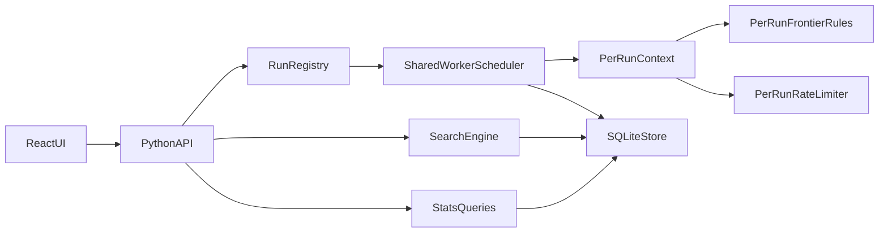

# Multi-Crawl Isolation + React UI Plan

## Goals

- Support **n concurrent crawl runs** with per-run identity and independent lifecycle.
- Enable **global search by default** with optional run filter and per-run search experience.
- Add configurable crawl parameters: **hit rate**, **queue capacity**, **max URLs**.
- Add crawl deletion that removes run data safely.
- Replace current UI with a React app (built assets served by Python) and separate pages for Start/Search/Status.

## Backend Changes

- Update crawl run model to include user-configurable settings and run-level counters.
  - Extend `[src/core/index_store.py](C:/Users/mertk/Desktop/University/BLG%20483E%20-%20Artificial%20Intelligence%20Aided%20Computer%20Engineering/vibedVoyager/src/core/index_store.py)` schema/migrations with:
    - `crawl_runs.max_urls`
    - `crawl_runs.hit_rate`
    - `crawl_runs.queue_capacity`
    - `crawl_runs.urls_discovered`
    - `crawl_runs.urls_processed`
- Refactor runtime orchestration in `[src/core/crawler.py](C:/Users/mertk/Desktop/University/BLG%20483E%20-%20Artificial%20Intelligence%20Aided%20Computer%20Engineering/vibedVoyager/src/core/crawler.py)`:
  - Introduce **per-run runtime state** (`RunContext`) for throttling, queue limits, and progress.
  - Enforce `max_urls` during enqueue/visit transitions.
  - Keep concurrent runs isolated while sharing worker infrastructure.
- Add data-layer operations:
  - `list_runs()`, `get_run(run_id)`, `delete_run(run_id)` (cascade delete).
  - Run-scoped status snapshots and aggregate status.

## API Contract Additions

- Evolve `[src/api/server.py](C:/Users/mertk/Desktop/University/BLG%20483E%20-%20Artificial%20Intelligence%20Aided%20Computer%20Engineering/vibedVoyager/src/api/server.py)`:
  - `POST /index` accepts `{ origin, k, hit_rate, queue_capacity, max_urls }`.
  - `GET /runs` list all runs with summary metrics.
  - `GET /runs/{run_id}/status` per-run status.
  - `DELETE /runs/{run_id}` delete crawl + indexed data.
  - `GET /search?q=...&run_id=...` where `run_id` is optional; default is global search.
- Keep existing `pause/resume` and decide scope:
  - default to **per-run pause/resume** endpoints (`POST /runs/{run_id}/pause`, `POST /runs/{run_id}/resume`) while preserving backward compatibility if needed.

## Search Behavior

- Update `[src/core/search.py](C:/Users/mertk/Desktop/University/BLG%20483E%20-%20Artificial%20Intelligence%20Aided%20Computer%20Engineering/vibedVoyager/src/core/search.py)`:
  - Global search default.
  - Optional run-scoped filtering with same triple output `(relevant_url, origin_url, depth)`.
  - Include run metadata in API response envelope for UI grouping.

## React UI (Static Build Served by Python)

- Create frontend app in `[frontend/](C:/Users/mertk/Desktop/University/BLG%20483E%20-%20Artificial%20Intelligence%20Aided%20Computer%20Engineering/vibedVoyager/frontend/)` with routes:
  - `/start` for creating runs and setting parameters.
  - `/search` for global/default search + run filter.
  - `/status` for run cards/table, queue/backpressure, and delete controls.
- Build polished UI components:
  - Run selector, status badges, metric tiles, charts/sparklines (lightweight).
  - Data table for pages sampled from DB (top domains, processed URLs, failures).
- Update Python server to serve built assets from `frontend/dist`.

## Data/Status Statistics (UI Enhancements)

- Add backend stats endpoints for database insights:
  - pages indexed per run
  - dead-letter counts per run
  - depth distribution
  - top terms/domains (bounded result sets)
- Display these in status page as extra analytics cards.

## Reliability and Deletion Semantics

- Ensure delete safety:
  - If run is active, either reject delete unless paused/stopped, or perform graceful stop then delete.
  - Clear in-memory state + DB rows transactionally.
- Add defensive worker error guards so one run’s issue does not terminate worker threads.

## Testing and Verification

- Extend tests in `[tests/](C:/Users/mertk/Desktop/University/BLG%20483E%20-%20Artificial%20Intelligence%20Aided%20Computer%20Engineering/vibedVoyager/tests/)`:
  - concurrent multi-run indexing isolation
  - run-scoped vs global search correctness
  - max_urls enforcement
  - delete run behavior (active/inactive)
  - per-run status integrity and counter consistency
- Add API tests for new endpoints and parameter validation.
- Add frontend smoke checks for route navigation and core workflows.

## Implementation Flow

## Deliverables

- Multi-run capable backend with run-level controls and deletion.
- Configurable crawl parameters per run.
- React multi-page UI served statically by Python.
- Updated docs for setup/build/run and API usage.
