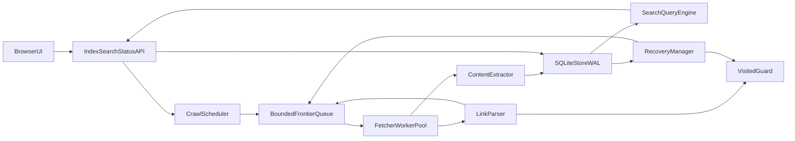

# Native-Search Development Plan

## Scope and Design Decisions

- Primary interface: localhost **Web UI**.
- Backend/logic: Python, using language-native modules for crawl and concurrency (`urllib`, `html.parser`, `queue`, `threading`, `sqlite3`, `http.server`).
- Core requirement: `search` remains available and reflects new discoveries while `index` is active.
- Persistence target: robust recovery via durable queue/state + idempotent indexing.

## Proposed Project Structure

- `[product_prd.md](C:/Users/mertk/Desktop/University/BLG%20483E%20-%20Artificial%20Intelligence%20Aided%20Computer%20Engineering/vibedVoyager/product_prd.md)` (source requirements)
- `[src/core/crawler.py](C:/Users/mertk/Desktop/University/BLG%20483E%20-%20Artificial%20Intelligence%20Aided%20Computer%20Engineering/vibedVoyager/src/core/crawler.py)` (worker pool, frontier, dedupe, depth traversal)
- `[src/core/index_store.py](C:/Users/mertk/Desktop/University/BLG%20483E%20-%20Artificial%20Intelligence%20Aided%20Computer%20Engineering/vibedVoyager/src/core/index_store.py)` (SQLite schema, insert/query APIs, WAL mode)
- `[src/core/search.py](C:/Users/mertk/Desktop/University/BLG%20483E%20-%20Artificial%20Intelligence%20Aided%20Computer%20Engineering/vibedVoyager/src/core/search.py)` (relevance scoring + `(relevant_url, origin_url, depth)` output)
- `[src/core/link_parser.py](C:/Users/mertk/Desktop/University/BLG%20483E%20-%20Artificial%20Intelligence%20Aided%20Computer%20Engineering/vibedVoyager/src/core/link_parser.py)` (HTML link extraction via `html.parser`)
- `[src/core/rate_limit.py](C:/Users/mertk/Desktop/University/BLG%20483E%20-%20Artificial%20Intelligence%20Aided%20Computer%20Engineering/vibedVoyager/src/core/rate_limit.py)` (token bucket/back-pressure)
- `[src/api/server.py](C:/Users/mertk/Desktop/University/BLG%20483E%20-%20Artificial%20Intelligence%20Aided%20Computer%20Engineering/vibedVoyager/src/api/server.py)` (`/index`, `/search`, `/status` endpoints via stdlib HTTP server)
- `[web/index.html](C:/Users/mertk/Desktop/University/BLG%20483E%20-%20Artificial%20Intelligence%20Aided%20Computer%20Engineering/vibedVoyager/web/index.html)` + `[web/app.js](C:/Users/mertk/Desktop/University/BLG%20483E%20-%20Artificial%20Intelligence%20Aided%20Computer%20Engineering/vibedVoyager/web/app.js)` (minimal dashboard)
- `[tests/](C:/Users/mertk/Desktop/University/BLG%20483E%20-%20Artificial%20Intelligence%20Aided%20Computer%20Engineering/vibedVoyager/tests/)` (unit + integration tests)

## System Architecture

## Core Runtime Behavior

- `POST /index` enqueues `(origin_url, url, depth=0)` job and spawns/uses shared worker pool.
- Worker loop: pull job from bounded queue -> enforce rate limiter -> fetch page -> parse links -> normalize URLs -> dedupe -> enqueue child links up to depth `k`.
- Each successfully fetched page writes page metadata + tokenized terms + crawl lineage `(origin, depth)` into SQLite in short transactions.
- `GET /search?q=...` runs SQL-backed retrieval + simple ranking (term frequency + title/url boosts) and returns triples.
- `GET /status` exposes queue depth, active workers, processed count, dedupe size, throttle state, and per-origin progress.

## Concurrency and Back-Pressure Strategy

- **Bounded frontier:** `queue.Queue(maxsize=N)` prevents unbounded memory growth.
- **Worker pool:** fixed number of worker threads tuned for I/O-bound workload.
- **Rate limit:** global token bucket (requests/sec burst cap) + optional per-domain cooldown.
- **Circuit breakers:** temporary retry with capped attempts, exponential backoff, then dead-letter table for failed URLs.
- **Search while indexing:** SQLite WAL mode allows readers during writes; keep write transactions short and batch inserts modestly.

## Robust Resume/Recovery Design

- Persist frontier, visited URLs, and page/index records in SQLite tables (`frontier`, `visited`, `pages`, `terms`, `page_terms`, `crawl_runs`).
- Use deterministic URL normalization and uniqueness constraints to make replays idempotent.
- On startup, recovery manager reloads unfinished frontier items and active crawl runs.
- Commit crawl progress checkpoints (`processed_count`, `last_seen_at`) periodically.
- Use WAL + `synchronous=NORMAL/FULL` based on durability preference; document trade-off.

## API Contract (Initial)

- `POST /index` body: `{ "origin": "https://...", "k": 2 }` -> returns run id.
- `GET /search?q=term&limit=50` -> returns `[ [relevant_url, origin_url, depth], ... ]`.
- `GET /status` -> global + per-run stats and back-pressure indicators.
- `POST /control/pause|resume` (optional) for operational control while testing.

## Testing and Validation

- Unit tests: URL normalization, depth limiting, link extraction, dedupe, ranking logic.
- Integration tests: local fixture pages verifying no duplicate crawl, correct depth, and live search visibility during active indexing.
- Load test script: simulate high frontier pressure, confirm queue cap and throttling behavior.
- Recovery tests: kill process mid-crawl, restart, and verify continuation without recrawling duplicates.

## Delivery Milestones

- **M1:** crawler core + dedupe + bounded queue + rate limiting.
- **M2:** SQLite-backed index + live search + status metrics.
- **M3:** localhost web UI wired to API.
- **M4:** robust resume/recovery and stress testing.
- **M5:** docs (architecture rationale, assumptions, operational guide).
